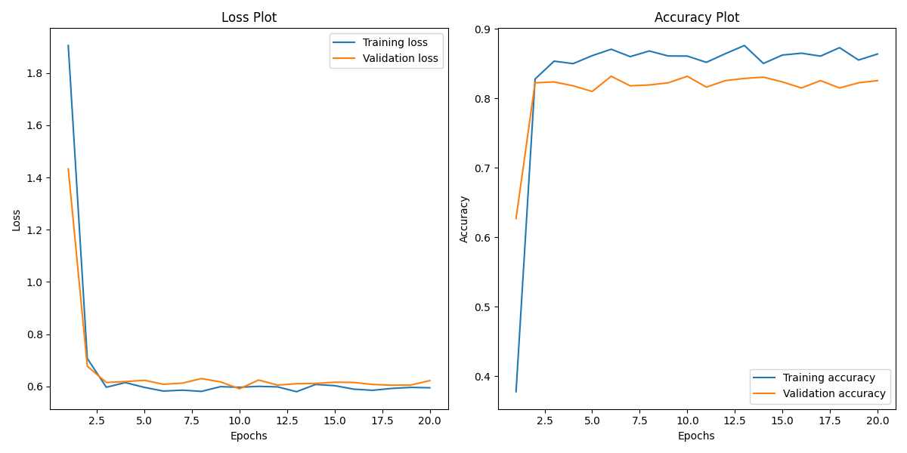
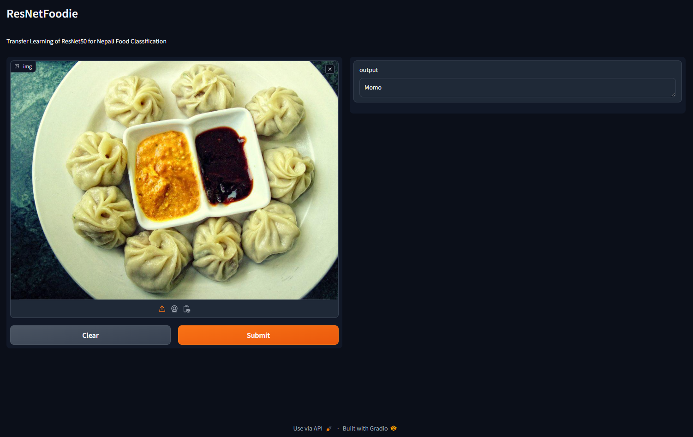
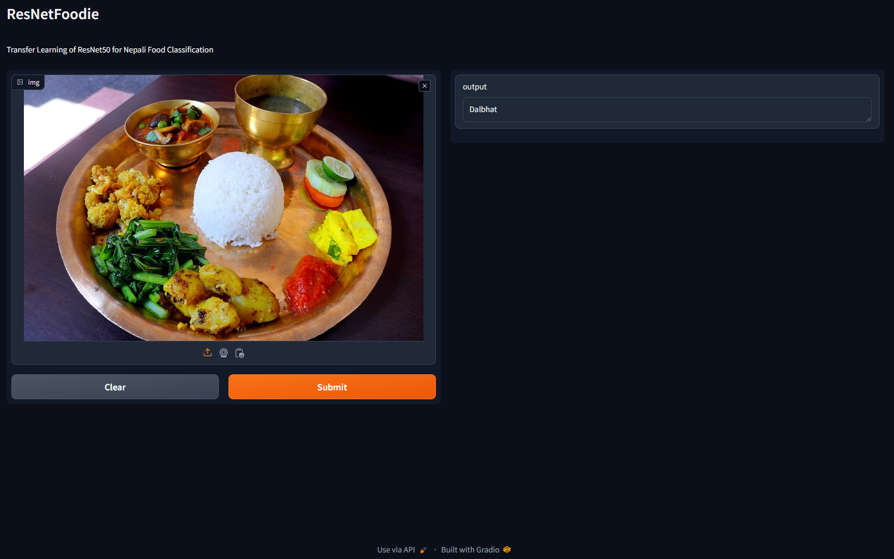

# ResNetFoodie

This app is Transfer Learning of ResNet50 for Nepali Food Classification. 

Currently supports 8 food classes = ['chatamari', 'chhoila', 'dalbhat', 'dhindo', 'gundruk', 'kheer', 'momo', 'sekuwa', 'selroti']

Dataset: https://www.kaggle.com/datasets/saurabkunwar/nepali-food-images

### Plots

Trained for 100 epoch, the model achieved accuracy of 87% during training and 82% on validation and testing datasets.

### Inference

